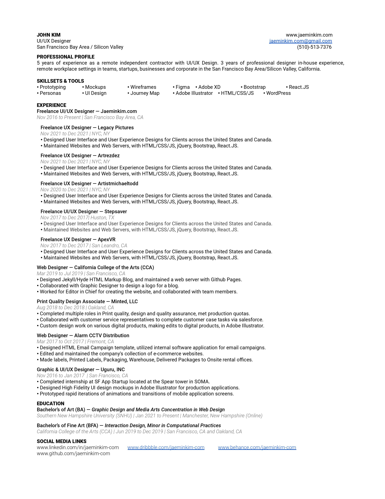

# Chapter 9: Getting Design Job Secret

## How do I get a designer job when I have no experience?
### How do I get a job when I have no experience?
#### I apply to 1000s of jobs but never get a reponse why?
#### Why dont recruiters contact me back?
#### Why dont companies contact me for interviews?

Are these questions you are constantly asking yourself? Let me tell you how it is. 

## The Cream 
The designer cream, is one which starts early, before high school. Do you remember the kids that had rubix cubes in high shool? Those kids became programmers. They applied to the best colleges and got into the best majors and now have a selection of the jobs they can get. They get multiple offers, and yes they will leave a job to get a better job, so after they leave the position opens up again. Be aware of the competition and be aware of the cream.

## The rest of us
OK, so you are not from the perfect background, for example maybe you had to work right after high school or maybe you got to start working labor jobs at 16. Or maybe you do have a background but you were the kid that had to work federal work studies and lets just say your meal plan wasent perfect.

## The Secret
Here is the secret.

Because I have been there as well, in a place where it wasent pretty and it was pretty depressing. It seemed as if everyone had experience and I had nothing. Because it was true, I was not ready for the work that is required to become a designer. The main problem is the skill level is just not there, and even if there was a huge talent, it would have to be molded into something that can be productive.

The secret is this.

Create a website, a portfolio website, and start becoming a remote contractor for design. Apply for design positions remotely, apply for gigs, and start getting paid for small piece work. Slowly add these into your online portfolio and see how year after year how it grows.

For example:

My portfolio website is www.jaeminkim.com, and it is my remote contractor website.

I have been keeping track of how long I have been working on this portfolio website and as myself as a remote contractor.

Sometimes the work was not consitent, and I did work various other jobs not related to design, which will not be on my design resume.

The first year will be difficult, especially if you have bills to pay. Do not expect to be able to cover everything by working as a designer.

Instead focus and go on even if things dont go your way.

Keep it up and keep looking for more gigs, and keep improving your portfolio.

The second year, you will be able to see more progress.

Now the third year, fourth year, and even fifth year.

Now all of a sudden you have put 5 years into yourself as a designer, with your own portfolio website and a list of client work that was paid, and now you see that all of a sudden you do have experience.

You have 5 years of experience as a remote contractor designer.

Now using this experience you will have a real chance to get a job, because although it wasent the most docuemented job, you can still put it as something you did.

From here on, it will get ALOT easier to apply for jobs, and gigs.

Once you are here you will be able to apply to the jobs that normal people are applying to, for example more full time positions, etc.

This is the way to go if you arn't part of the design cream.

But remember that 5 years without making progress with clients, or if your portfolio is not amazing after 5 years, then it might have more to do with a lack of skill, than lack of trying.

## Conclusion

It's alot to ask someone to really struggle and build out something for themselves without much financial help. Additionally facing the reality of having to support your ambitions of being a designer. Some do not have that luxury, and for some even trying to make this happen for themselves is a difficult journey.

This is the designer journey, unless you had support to go to the best art colleges in the country, and you were able to concentrate on your studies and you graduated. But even then, you will be suprised to see the number of graduates that still dont have design jobs.

Because of this reason. Once you have 5 years of experience as your own remote contractor with your own portfolio, you will be seen next to the cream. The cream have the best credentials, and sometimes even the best experience of internship while they were in school.

But now they will actually look at you and give you a chance. So if you have a portfolio now that is actually better than the ones that come out of the art schools, because you have paid client work for example, even if that work was done for 20 dollars, is still client work, you because of that a portfolio filled with paid client work is actually better than a student portfolio with only personal and student projects.

So this means now you will be able to compete against the cream, and the only way to show that you have the stuff is with a portfolio.

When your portfolio is better than the rest of the competition you will get the job over someone with better credentials. This is common is places with less restriction, such as in the art and the design fields.

If you are willing to put in that time and that work.. then you can become a designer. If you are not willing to do this kind of work, you can apply for art college and try to have the word UX in your major, please.

At the end of the day, when you do have this portfolio that you have built out over several years, and the quality is there, you can start seeing people respond based on the portfolio alone.

Now if you have the resume with your contractor position on your resume.

For example mine is this:

Remote UX Designer
Company Name jaeminkim.com Contract
Dates EmployedNov 2016 – Present
Employment Duration4 yrs 9 mos
LocationSan Francisco Bay Area
• Designed User Interface and User Experience Designs for Clients across the United States and Canada.
• Maintained Websites and Web Servers, with HTML/CSS/JS, jQuery, Bootstrap, React.JS.
• Accomplished design tasks using Adobe Illustrator and XD, and produced design assets.

With this part in the resume, recruiters can consider this as experience that can replace a college degree.

The important part is that the portfolio needs to be stellar. 

Here is my current resume, as you can see there is a section where it states that there was experience as a remote independent contractor, and then it lists out the clients that were worked for during that time.

If you are looking for help with your portfolio, and need mentorship or a review, feel free to reach out at uxdesignsumo@gmail.com