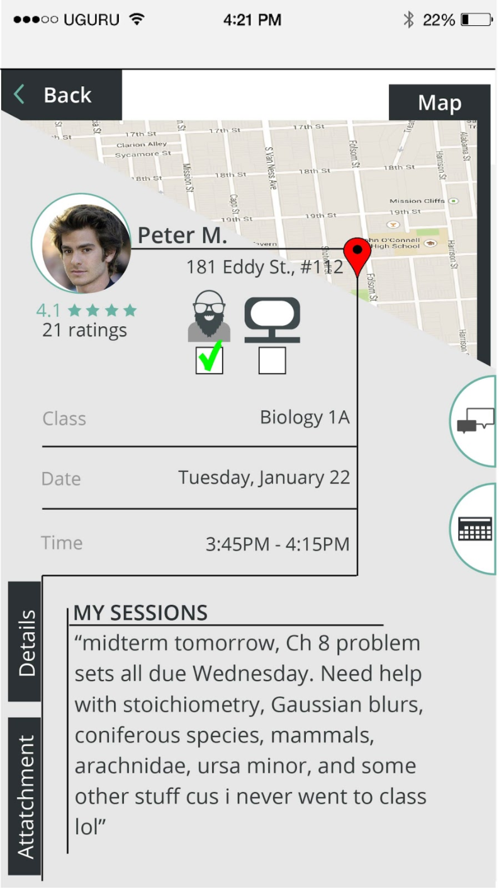

# Chapter 2: The Designer Journey

What is the design journey? 

In the context of this book, it is about how to become a designer. 

It's about the journey of becoming a designer.

How do you get to become an UX Designer?

<!--- Those same people maybe also say things like I feel like an Imposter. They have an Imposter Syndrome, its because they are an imposter. Why would someone who actually understands their background, feel Imposter Syndrome at this point in their Designer Journey, Insecurity about yourself is something mature designers have overcome at this point, maybe even at a very early age. --->

Before going over step by step what lead someone to pursue UX Design as a profession, it important to note that the background of an individual can have more impact on one's choices in the future than we know. So for people who are here still uncertain about what the future holds let's talk a step back together and piece together what lead you to choosing UX Design as a profession.

Because there are so many different types of background, and avenues where people took to get here it isn't very clear at times, what the exact journey really is. So instead lets talk about some possible ways to have gotten here at UX Design.

Type 1: You have a degree in UX Design from an acceditted university.

Talk about some of the best art school in the world, such as Hongik University, Art Center,  Pratt Art School, California College of the Arts (CCA). There is a whole process to becoming a designer. For example the portfolio to get into art school.

Type 2: You come from a more diverse background, work different odd jobs and also had meaningful career moves unrelated to UX Design. College wasn't seen as an option after High School, and instead had a financially fulfilling career in the trades, now looking to transition into a more concrete UX Design Role. 

Type 3: Still in High School, interested in various topics but looking to select something in design that is competitive and financially fulfilling. Either State or Private Art Colleges is an option, but unsure about scholorships as well UX Design.

Type 4: You graduated with a degree related to design and have a job as a designer.

Type 5: You graduated with a degree related to design and you have a job that is unrelated to design.

Type 6: You graduated with a degree related to design and you are looking for an UX Design Job.

Type 7: You graduated with a degree unrelated to design and have a job as a designer.

Type 8: You graduated with a degree unrelated to design and have a job that is unrelated to design.

Type 9: You graduated with a degree unrelated to design and you are looking for an UX Design Job.

Not you at all? 

What kind of type are you?

Write it here:

Type Z: 

<!-- Actually, it doesnt matter about your background. Because someone from Type1 could get run over by a car and die in the middle of their internship. --->

The best way to becoming an UX Designer is to get a degree in UX Design at an acceditted university. For example a Bachelors degree in UX Design. Afterwards there are graduate programs for example in Human Computer Interaction.

There was a time before there was UX Design available as a choice at university. So for a certain demographic there was no option for UX Design.

Background isnt everything. Talk about your personality and what kind of person you are to be uniquely natural affinity to design, art, creativity.

Do you have a background in Phycology?

Do you have a background in Software Enginnering?

Do you have a background in Customer Service?

Do you have a background in Industrial Design?

Do you have a background in Graphic Design?

Do you have a background in Fine Art?

Do you have a background in Product Design?

Do you have a background in Interaction Design?

Do you have a background in User Experience Design?

Do you have a background in User Interface Design?

Do you have background in Web Design?

Doesn't matter about the background.

So lets talk instead about what it takes to make it as a Designer.

And the steps it took to make it as an UI/UX Designer.

1. Appreciation and a background in the arts

Fine Art for the people born before the start of the internet, Yes you I see you and I am going to tell you that it is not too late and it is not impossible to become an UX Designer, an appreciation for the arts is key. You have to love what you do... if you want to become a Designer because of the salary you will be wrong.

2. Affinity with Technology

Technology devices is one of the mediums that UX Designers use.

3. Deep connection with empathy

This is something that cannot really be bought or even learned in a institution setting.

But practicing good accessibility laws and standards will meet most empathy problems.

What about the development of UX Designer Skillsets?

When do you know when you are good enough as an Designer?

Talk about the my journey maybe they can learn from my journey

Now I would like to share my personal design journey, and we can begin to break apart piece by piece the steps it took to become a Designer. As well as the process of shifting into a different design medium such as UX. Or looked at in a product len then changing product to UI.

My personal journey as a designer started from a background in the Fine Arts. 

<!--- As many of you may have also experienced, my childhood was mainly unsupervised full of being enclosed in non airconditioned rooms, without TVs or Computers, actually the internet wasent really that good yet, people still used dial up and land lines. So I loved to draw and also write, being able to draw really saved my life at an early age. In High School which I attended in the Silicon Valley, California, I took AP Art, which means I took Art I, II, III then can take AP Art. --->

In High School, attended Mission San Jose High School in the Silicon Valley, California, took AP Art.

After High School, attended Hongik University in Seoul for Industrial Design for a year, Actually my background is still in the process but I can share things up to know. 

So the first major I picked was Industrial Design.

<!--- and I learned about what is Industrial Design and what is Product Design? I still dont really have a good answer, but to be quite honest Industrial Design is the old way of doing things. When things were more mechanical and hardware was more profitable in nature. This was actually before the Iphone was really that big, the first iphones came out when I was in High SChool. So the field of User Interfaces actually didnt really exist, besides on the computer like website, mobile applications were still not really a thing. It was really more like graphic designers who worked mainly on the web became web designers, and when mobile came out they became UI Designers, and Interaction Designers combined and became UI/UX Designers because probably the tech industry and the way they try to make sense of the labor. --->

After returning to the United States of America, I attended DeAnza College in Cupertino for Graphic Design. 

I transfered from DeAnza College to California College of the Arts In San Francisco, CA and Oakland, CA. My major I kept as Industrial Design. 

I did an internship at downtown san franciso in the spear tower at a mobile application startup. For UI/UX Design and Graphic Design Intern.

## Story Starts Here

So this is where the UX story starts, because this is a design journey everything that lead up to this point was everything besides UX. 

So where were you when that transition happen?

Because becoming a designer, you have to pick a major related to design. Now you are a designer, but you have to finish college, and you have to have relevant skillsets. So everyone here is a designer. But the question is when did you make the transtion into UX?

Because I started as an Industrial Designer, I was unaware of this industry called UX Design. I was looking for a job in 2016, which turned into an internship at the Spear tower in Downtown San Francisco (SOMA), for a UI/UX and Graphic Design Internship. 

Is this luck? There are many ways to look for an internship, for example job fairs at California College of the Arts, where various companies show up to look for qualified interns.

When I started my internship, I was mainly doing office tasks for example buying for the office from Target, office tasks, and others.

One of the first tasks was the make graphics related to their logo.

There I did my first UI Design, I will share it here.

I will now critic this UI Design.

I know this is your first design. Its not bad for a first design. It shows quite a lot of creativity and attempted innovation. But just based on even just the text hierarchy it is clear this design is quite amateurish.  

But there is some basic understanding about things like buttons, or indicators, as well as attempts to create padding and margin rules from nothing.

For someone with no previous experience doing UI design, this is actually not the worse thing, ever, because it does show some basic design understanding. As well as an attempt to create something that mimics UI Design rules.

What I like about this design is that it is an original. because of that fact, this design is passable.

An original design is better than an amazing prebuilt.. at least when it comes to personal expections.Actually starting from a prebuilt and then working on the design will save alot of time and will solve most of these padding issues, and text issues, as well as this design being done back in 2015, where it was for the iphone 5, now we are iphone max 12.

I did an 3 month internship and my favorite design I did for that startup is this one here.

This is actually two designs. One it showcases a UI inside the UI. The design is for an onboarding screen, and that onboarding screen uses an UI that was designed for the Production Application. 

This one is slightly better, and it shows that there was impovement, for example the use of text and the heirarchy of the text is alot better.

As well as the positioning of the elements on the Usser Interface.

This one is better it shows a lot of improvement.

So now what? 

During this period of time, learn how to program in standard computer languages. The main reason was so could create a website to have a portfolio. So because of that learned HTML/CSS and even started to be able to read JavaScript. I was also inspired by the people around me who motivated me to learn how to program, without them I wouldnt have had the motivation to learn such a technical skill.

I go back to school at California College of the Arts, this time for Interaction Design with Computational Practices. 

There my eyes were opened, really actually by my amazing professors, which showsed me the other side, the side that I didnt really know existed. and that side is called User Experience.

Because everything I did at this point was mainly visual, the User Interfaces looked OK but there was not really any solid research to backup the designs. There needs to be solid documentation on the reasons why a design was chosen over another.

There I started to learn about things such as User Testing

There is so much more than just the visuals.

And they were absolutly correct there is much more under the surface than what is seen.

For example 

Using my background in understanding HTML and CSS, created designs that integrated technical coding and user interface design, as well as paying attention to user experience, in this particular case accessibility.

So now we are here, and I am finishing up my bachelor degree in Graphic Design with Web Design, at Southern New Hamsphire University. Doing everything remote, transfered in half the credits. Also to note for people wondering how this is financially possible, I am a scholarship recipient, I recieved CCA Scholarship, Cal Grant B, Clorox Scholorship, Pell Grant. Additionally throughtout my college experience I always work one or two or three part time jobs and gigs. Also Throughtout college I was signed up with the United States  Selective Services which was what allowed me to fund my higher education, because of this I also recieved federal work study. Because of this I always struggled to keep my academics and finances sperate but, now I have a 3.5 Overall GPA at Southern New Hamspire University. My education dream is to continue to finish my bachelor degree and then get my masters degree in Computer Interaction Design.

## Now its your turn

Lets create your Designer Journey based on this template

This template is your explaination for why you have become an UX Designer, as well as the jounrey you went on to becoming an UX Designer. If the question doesnt apply to you please skip and answer the ones that apply to you.

**Pep Talk**

Listen not everyone can sacrifice so much to become who they want to become. Maybe your background is to say the least, extra ordinary. In this case, I would highly suggest that without let's say a high school diploma or a GED, that staying in school is probably a good choice. Now that we have covered that, you can become an UX Designer without a high school diploma. Yes, I said it, you can become an UX Designer without a High School Diploma, now if you really think in the long term that putting a few hours in now that you have time to investing into your future as a designer getting that High School Degree or GED can and will help you in the future. You have a background in UX Design if you look hard enough you can create your own destiny.

Preminary questions:

1. I am Type [FILL].
2. I am least like Type [FILL]
3. I have a Appreciation and a background in the arts yes or no
4. I have an affinity to Technology yes or no
5. I have a deep connection to empathy, yes or no

Beginning

1. My personal journey as a designer started from a background in the [FILL].
2. I was luckly or I was unlucky because [FILL].
3. Sometimes I do feel like an imposter but then I [FILL]

2. My childhood was [FILL].

3. I love to [FILL] and [FILL].

4. In High School, which I attended in [FILL], I [FILL].

5. After High School, I [FILL].

Middle

1. So the first major I picked was [FILL]
2. My first UX Internship was at [FILL]
3. My first UI Design was [FILL]
4. There was this much [FILL] time between now and my first UI Design.
5. I will now critic my first UI Design, [FILL]
6. I improved based on the first UI Design, yes or no, [FILL]
7. My first UX Job was [FILL]
8. During this period of time, I [FILL]
9. Using my Background, I [FILL]

End

1. So now we are here,. and I am [FILL]
2. Now what? [FILL]

Please complete this template so based on the template, I will let you know which chapters you can skip in this book and which ones you maybe more interested than the others.

So lets take a look at your designer journey. 

Preminary questions

So that's everything you need to be a designer?

Not quite why dont you write in a couple extra skills that you have that are unrelated to Design. 

Beginning 

So you have a couple of falls during the beginning and no matter what you try the world is pushing you away design? Did you ever have a dream? Did you always think about pursing a career in the creative field? What was 

Middle 

Do you feel unmovated at your uncreative daily job? What was your actualy dfirst job, even if it wasent UX related. Did you apply to UX Design Jobs but was rejected? Have you never worked a job? 

End

Have you finished school?

 What are your future plans?

What are you looking for salary range?

Did you give up, why and did you come back?

What happened when you came back?

 

Now based on this information

Here is the lesson plan, just read the following chapters in the following order.

Chapters you can skip.

Chapters to pay attention to.

At UX Design Sumo, we are dedicated to you in also making your journey to an UX Designer, wether your interest lay mostly in the User Interface or if you are more interested in User Experience or if you are more interested in User Research.

Whatever your preferrence, your Designer Jounrey is one of the mopst important to a designer's life and at UX Design Sumo, we hope we can become a stepping stone in your jounrey to become a 6 figure UX Designer.

[uxdesignsumo.com](http://uxdesignsumo.com)