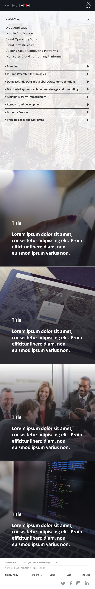

# Jaemnkm Studio

    Copyright (C) 2019 Hillotech, LLC. All Rights Reserved
    This program is free software; you can redistribute it 
    and/r modify it under the terms of either the GNU General 
    Public License or the Artistic License. THIS SOFTWARE 
    IS PROVIDED BY THE COPYRIGHT HOLDERS AND CONTRIBUTORS "AS IS"
    AND ANY EXPRESS OR IMPLIED WARRANTIES, INCLUDING, BUT NOT LIMITED 
    TO, THE IMPLIED WARRANTIES OF MERCHANTABILITY AND FITNESS 
    FOR A PARTICULAR PURPOSE ARE DISCLAIMED. IN NO EVENT 
    SHALL THE COPYRIGHT OWNER OR CONTRIBUTORS BE LIABLE 
    FOR ANY DIRECT, INDIRECT, INCIDENTAL, SPECIAL, EXEMPLARY, 
    OR CONSEQUENTIAL DAMAGES (INCLUDING, BUT NOT LIMITED TO, 
    PROCUREMENT OF SUBSTITUTE GOODS OR SERVICES; LOSS OF USE, 
    DATA, OR PROFITS; OR BUSINESS INTERRUPTION) HOWEVER CAUSED 
    AND ON ANY THEORY OF LIABILITY, WHETHER IN CONTRACT, STRICT 
    LIABILITY, OR TORT (INCLUDING NEGLIGENCE OR OTHERWISE) 
    ARISING IN ANY WAY OUT OF THE USE OF THIS SOFTWARE, 
    EVEN IF ADVISED OF THE POSSIBILITY OF SUCH DAMAGE.

## file structure

### A - index.html
### B - index_mobile.html
### C - index_desktop.html
### D - main-mobile.css
### E - main.css
### F - main.js

## folder structure

### app

- index_desktop.html

- index_mobile.html

### css

- main.css

### images

### js

- main.js

### index.html

Build with HTML/CSS/JS first and then add a Framework.

I think the sections should lead to a seperate service page.

For example:

Service: Human-Computer Interaction Design

- Application Demo

    Will lead directly with the white paper portfolio page.

Service: Graphical User Interface Design

Service: Full-Stack Web Development

